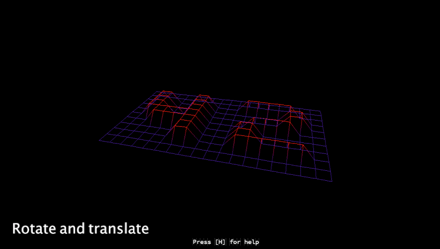
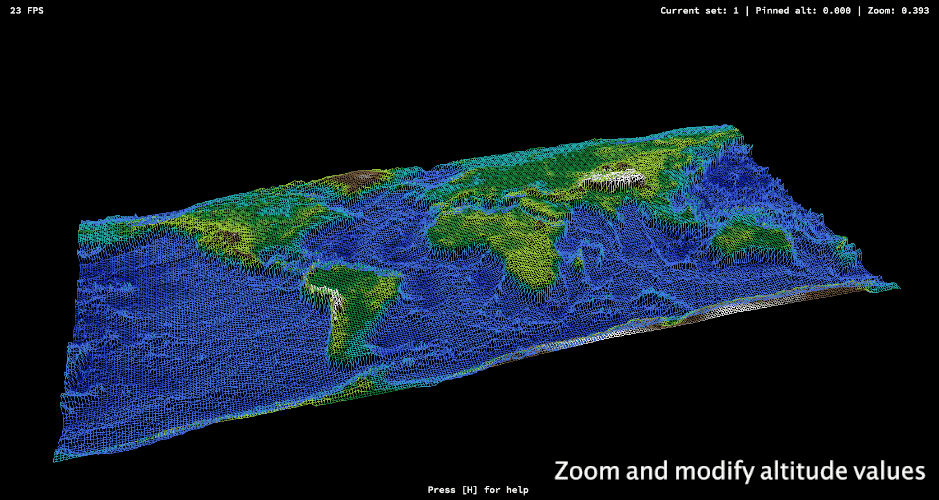
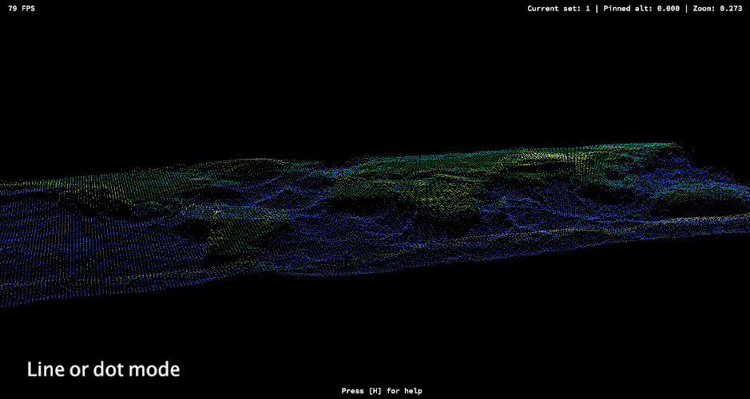

# Fdf

A basic 3D rendering engine for height maps, represented as wireframes

Note : Only works on macOS 10.12 and later

## Features

* Camera controls (zoom, rotation & translation)
* Color gradient & single color modes
* Supports colors in map files
* Dots-only mode
* Perspective (default) & orthographic projections
* Line clipping
* FPS Counter and help/debug panels
* Circular frame-buffering
* Multithreaded drawing & frame cleaning

## Screen captures









## Usage

First, clone
```sh
$ git clone https://github.com/bil0u/fdf.git
```

A Makefile is provided, just run in your shell
```sh
$ make
```
or call it from a parent one with the rule `make -C ./<fdf_path>`

To run, just type
```sh
$ ./fdf [path/to/map]
```
A bunch of samples maps are provided in the `maps` directory.

## Controls

Keyboard control only (Default mapped to US). Mouse is not supported for the moment.  

* `R / T`  
   Respectively switch beetween rotate (default) & translate modes  
* `Arrows`  
   Control rotation & translation  
* `Z / A`  
   Respectively switch beetween zoom (default) & altitude modes  
* `+ / -`  
   Control zoom & altitude values  
---
* `C`  
   Switch beetween gradient (default) & mono color mode
* `V / X`  
   Respectively increase & decrease the pinned altitude for current color set
* `Space`  
   Select next color or color gradient depending on the actual mode  
---
* `Alt left`  
   Switch between wireframe (default) & dot modes  
* `P`  
   Switch beetween perspective (default) & orthographic projections  
---
* `H`  
   Show/hide help panel  
* `D`  
   Show/hide FPS counter & debug infos  
---
* `Shift left / right`  
   Respectively slow down & speed up the controls sensitivity  
* `Command + <key>`  
   Locks the `<key`, useful for rotations/zoom. When locked, repress the `<key` once to unlock  
---
* `Delete`  
   Reset view to original position  
* `Q / Escape`  
   Quit the program  

## License

This project is licensed under the GNU General Public License v3.0 - see the [LICENSE.txt](LICENSE.txt) file for details
